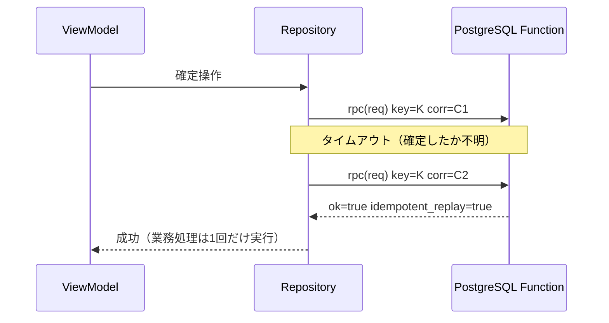

# RPC共通契約

- 状態: 草案（Issue #4のレビューで確定）
- 対象Issue: [#4 FND-03](https://github.com/Re-Ochuns/Kiwi_peoducts/issues/4)
- 関連: [ADR-0001](../docs/adr/0001-system-architecture-and-ownership.md)、[03. 状態遷移・データモデル](../production-spec/03_STATE_AND_DATA_MODEL.md)、[07. 非機能・セキュリティ](../production-spec/07_NON_FUNCTIONAL_SECURITY.md)、[09. 共同開発・Issue運用](../production-spec/09_DEVELOPMENT_WORKFLOW.md)

すべての更新RPCに適用する契約の共通部分を定義する。個別RPCの契約は`contracts/rpc/<function名>.md`へ[テンプレート](templates/rpc-contract-template.md)に従って作成し、本書と矛盾させない。

## 1. 適用範囲

- 対象: クライアントが呼び出す業務更新のPostgreSQL Function（`/rest/v1/rpc/<function名>`）と、Edge Function（`/functions/v1/<name>`）。
- 対象外: 読み取り。読み取りはRLSで保護されたData APIを利用し、本書の封筒形式を使わない。
- 対象外: DB内部のヘルパー関数。クライアントへ公開せず、本書の命名規則の対象外とする。

## 2. 命名規則

### 2.1 Function名

`<領域>_<操作>`のsnake_caseとする。破壊的変更時は`_v2`以降を付ける（第10章）。初版に版サフィックスを付けない。

| 領域 | 英語 | 例 |
|---|---|---|
| 受入（収穫・仕入れ） | receiving | `receiving_register` |
| 選果 | sorting | `sorting_confirm` |
| コンテナ・在庫 | container | `container_move` |
| 追熟 | ripening | `ripening_plan_confirm` |
| 在庫予約 | reservation | `reservation_release` |
| 受注 | order | `order_confirm` |
| 出荷 | shipment | `shipment_confirm` |
| ラベル | label | `label_mark_printed` |
| 作業タスク | task | `task_complete` |
| マスター | master | `master_update` |

| 操作 | 意味 |
|---|---|
| register | 新規登録 |
| confirm | 状態遷移を伴う確定 |
| correct | 履歴付きの事後修正 |
| cancel | 取消・中止 |
| complete | タスク・作業の完了 |
| update | 状態遷移を伴わない属性変更 |
| mark_printed | ラベルの印刷済み枚数を記録し、必要枚数到達で完了する（ラベル領域） |
| mark_handwritten | ラベルを手書き対応で完了する（ラベル領域） |
| reprint | 印刷済みラベルを理由付きで再印刷する（ラベル領域） |
| deactivate | 削除の代わりの無効化。参照済みデータを残したまま選択肢から外す（マスター領域） |
| activate | 無効化したデータの再有効化（マスター領域） |

表にない領域・操作が必要な場合は、個別契約のレビューで英語名を確定し本表へ追記する。

### 2.2 JSONフィールド

- フィールド名はsnake_caseとする。
- 内部IDはUUIDの文字列とし、フィールド名を`<対象>_id`とする。表示IDは`display_id`とする。
- 重量はkg単位の数値とし、フィールド名へ`_kg`を付ける。小数第2位までを有効とし、超える値は`VALIDATION_FAILED`とする。
- 業務日付はAsia/Tokyoの`YYYY-MM-DD`とし、フィールド名へ`_date`を付ける。日時はUTCのISO 8601とし、フィールド名へ`_at`を付ける。表示時にJSTへ変換する。
- 列挙値はsnake_caseの英語とし、日本語との対訳を個別契約に記載する。

## 3. 要求形式

更新Functionは単一のjsonb引数`req`を受け取る。引数を複数にせず、封筒でメタ情報と業務入力を分離する。単一引数とするのは、冪等性判定・ログ・バージョン移行を全RPCで同じ実装にするためである。

```json
{
  "meta": {
    "idempotency_key": "9f4c1e5a-7b2d-4c8e-9a31-5d2f8c6b1a90",
    "correlation_id": "0c3d2b1a-4e5f-4a6b-8c7d-9e0f1a2b3c4d"
  },
  "input": {}
}
```

| フィールド | 必須 | 内容 |
|---|---|---|
| meta.idempotency_key | 必須 | UUID v4。業務操作単位（第6章） |
| meta.correlation_id | 必須 | UUID v4。呼び出し試行単位（第9章） |
| meta.app_version | 任意 | クライアントのビルド版。調査用 |
| input | 必須 | 操作固有の業務入力。個別契約で定義 |

操作者となる利用者はJWT（`auth.uid()`）から特定し、要求へ含めない。現場の作業担当者（マスター登録された作業者）は業務入力であり、必要なRPCの`input`で受け取る。

## 4. 応答形式

Functionはjsonbの封筒を返す。業務エラー・競合・権限エラーはHTTP 200の`ok: false`で返し、例外として漏らさない。分類済みエラーを正常なデータとして扱うことで、クライアントはHTTP層とPostgREST層の解釈へ依存せずに分岐できる。予期しない例外は捕捉せずそのまま失敗させ、クライアントが第5.2章で正規化する。

成功:

```json
{
  "ok": true,
  "correlation_id": "0c3d2b1a-4e5f-4a6b-8c7d-9e0f1a2b3c4d",
  "idempotent_replay": false,
  "data": {}
}
```

失敗:

```json
{
  "ok": false,
  "correlation_id": "0c3d2b1a-4e5f-4a6b-8c7d-9e0f1a2b3c4d",
  "idempotent_replay": false,
  "error": {
    "category": "business",
    "code": "SORTING_WEIGHT_EXCEEDED",
    "message": "選果後の合計重量が受入重量を超えています。",
    "retryable": false,
    "details": {}
  }
}
```

| フィールド | 内容 |
|---|---|
| ok | 業務操作が確定したか |
| correlation_id | 要求のmeta.correlation_idをそのまま返す |
| idempotent_replay | 保存済み応答の再生か（第6章） |
| data | 成功時の結果。個別契約で定義 |
| error.category | `business` / `auth` / `conflict` / `unexpected`（第5章） |
| error.code | SCREAMING_SNAKE_CASEのエラーコード |
| error.message | 利用者へそのまま表示できる日本語文言 |
| error.retryable | 同一要求の自動再送に意味があるか。`unexpected`以外は常にfalse |
| error.details | 機械可読の補足。省略可 |

クライアントは未知の応答フィールドを無視し、未知の`error.code`は`category`の既定動作へフォールバックする。

## 5. エラー分類

| category | 意味 | 例 | クライアントの既定動作 |
|---|---|---|---|
| business | 入力または対象が業務ルールを満たさない | 重量超過、期限切れ、状態遷移違反の入力 | 文言を表示し、入力修正を促す |
| auth | 未認証または許可されていない | セッション期限切れ、招待外アカウント | 再ログインへ誘導する |
| conflict | 他の操作との競合で前提が崩れた | 同時確定、冪等性キーの誤用 | 最新状態を再取得して画面を更新し、操作をやり直させる |
| unexpected | バグ・障害など予期しない失敗 | デッドロック、外部障害、契約不整合 | 汎用文言とcorrelation_idを表示する。retryableなら自動再送 |

### 5.1 共通エラーコード

全RPCで意味を共有する。個別契約の業務コードは`<領域大文字>_<内容>`とする（例: `SORTING_WEIGHT_EXCEEDED`）。

| code | category | 内容 |
|---|---|---|
| VALIDATION_FAILED | business | 形式・必須・値域の違反。detailsへ`field`と理由を含める |
| CONFLICT_STALE | conflict | 前提とした状態・数量が他の操作で変化した。可能なら`details.current`へ最新の主要状態を含める |
| IDEMPOTENCY_KEY_REUSED | conflict | 同一キーで内容の異なる要求を受けた |
| AUTH_REQUIRED | auth | 未認証またはセッション無効 |
| AUTH_FORBIDDEN | auth | 認証済みだが許可されていない |
| UNEXPECTED | unexpected | 分類できないサーバー内部の失敗 |

### 5.2 封筒に載らないエラーの正規化

封筒より外側で発生する失敗は、Repositoryが同じエラーモデルへ正規化する。クライアントの上位層は発生源を区別しない。

| 発生源 | 正規化 | retryable |
|---|---|---|
| 送信失敗・切断 | unexpected / `NETWORK_FAILED` | true |
| クライアントタイムアウト | unexpected / `TIMEOUT` | true |
| HTTP 401 | auth / `AUTH_REQUIRED` | false |
| HTTP 403 | auth / `AUTH_FORBIDDEN` | false |
| HTTP 5xx | unexpected / `SERVER_UNAVAILABLE` | true |
| PostgRESTの契約エラー（Function不在、引数不一致） | unexpected / `CONTRACT_MISMATCH` | false |
| DB例外がそのまま届いた（デッドロックなど） | unexpected / `UNEXPECTED` | true |

`CONTRACT_MISMATCH`は契約と実装の不一致を意味するため、自動再送せず調査対象とする。DB例外の再送は冪等性キー（第6章）によって安全である。

## 6. 冪等性

### 6.1 キーの規則

- クライアントは利用者が確認操作を開始した業務操作ごとにUUID v4を生成する。
- 自動・手動を問わず、同じ操作の再送では同じキーを使う。
- 利用者が入力を変更して再確定した場合、および画面を離れて操作をやり直した場合はキーを再生成する。

### 6.2 サーバーの動作

更新Functionは業務処理と同一トランザクションで次を行う。

1. `function名 + input`のハッシュを計算する。metaは含めない（correlation_idは試行ごとに変わるため）。
2. キーで冪等性記録を検索する。
   - 記録なし: キー・関数名・ハッシュを記録し、業務処理を実行する。確定した封筒（`ok`の真偽を問わない）を記録へ保存する。
   - 記録あり・ハッシュ一致: 保存済み封筒の`data`または`error`を返し、`idempotent_replay`をtrueにする。`correlation_id`は今回の要求の値を返す。
   - 記録あり・ハッシュ不一致: `IDEMPOTENCY_KEY_REUSED`を返す。
3. 同一キーの同時要求は、キーの一意制約によって先行トランザクションの確定を待つ。先行が確定していれば保存済み応答の再生となり、ロールバックされていれば後続が実行する。
4. `unexpected`でロールバックした場合は冪等性記録も残らないため、再送は業務処理を再実行する。

冪等性記録はキー、関数名、要求ハッシュ、応答、実行ユーザー、作成日時を持ち、最低24時間保持する。テーブル定義と清掃ジョブはS1-01で確定する。

## 7. 再送・タイムアウト

- クライアントの呼び出しタイムアウトは10秒とする。サーバー側の実行上限はこれより短く設定し、値はS1-01で確定する。
- 自動再送の対象は`retryable: true`（`NETWORK_FAILED`、`TIMEOUT`、`SERVER_UNAVAILABLE`）のみとする。business・auth・conflictを自動再送しない。
- 自動再送は最大2回（計3試行）とし、待機は1秒、2秒にジッターを加える。再送では同じ`idempotency_key`と新しい`correlation_id`を使う。
- ViewModelは結果確定まで確定操作を無効化して二重送信を抑止する。抑止をすり抜けた二重送信は冪等性キーが最終防衛となる。
- 全試行が失敗した場合はエラーを表示して停止する。利用者が同じ入力のまま再度確定した場合も同じキーで送る（第6.1章）。



## 8. 排他制御

- 更新Functionは対象行をトランザクション内でロック（`SELECT ... FOR UPDATE`）し、権限・状態・数量を検証してから更新する。
- 検証失敗のうち、他の操作や画面表示の古さによって前提が崩れたもの（すでに確定済み、残量不足など）は`conflict` / `CONFLICT_STALE`とする。最新状態でも成立しない入力（受入重量を超える選果合計など）は`business`とする。
- `CONFLICT_STALE`では、応答へ収まる範囲で`details.current`へ最新の主要状態を含め、クライアントの再取得を助ける。
- ロック待ちは許容し、サーバーの実行上限内に確定しない場合は失敗させる。デッドロック検出は`unexpected`とし、自動再送に委ねる。
- 楽観制御の前提値（クライアントが把握している版・状態）を`input`へ含めるかは個別契約で定義する。

## 9. 相関IDとログ

- `correlation_id`は呼び出し試行ごとにクライアントが生成する。再送では新しい値を使い、同じ`idempotency_key`が論理操作を束ねる。
- サーバーは関数名、`auth.uid()`、`correlation_id`、`idempotency_key`、`error.code`をログへ記録する。顧客情報・住所・自由入力の原文・トークンをログへ含めない。
- Edge Functionは受け取った`correlation_id`をログと下流のRPC呼び出しへ引き継ぐ。
- クライアントは`unexpected`の表示へ`correlation_id`を含め、問い合わせから該当ログへ到達できるようにする。

## 10. バージョニングと互換性

### 10.1 互換な変更（版を維持する）

- 省略可能な`input`フィールドの追加（既定値あり）
- `data`・`details`へのフィールド追加
- 既存カテゴリ内のエラーコード追加
- `message`文言の変更

クライアントは未知フィールドの無視と未知コードのフォールバック（第4章・第5章）によってこれらを許容する。

### 10.2 破壊的な変更（新版を追加する）

必須入力の追加、フィールドの削除・改名・型や意味の変更、成功条件・副作用の変更、エラーコードの削除・意味変更は破壊的変更とする。

1. `<function名>_v2`を追加するmigrationを適用する。旧版は残す。
2. 個別契約文書へ新版を追記し、3担当の承認を得る。
3. クライアントを新版へ移行してリリースする。
4. StagingとProductionで旧版の呼び出しがないことを確認した後、削除migrationを別PRで適用する。ブラウザにキャッシュされた旧クライアントが残るため、本番リリースから最低1週間は旧版を残す。

この手順はADR-0001の「DB migrationをアプリより先に後方互換な形で適用し、破壊的変更は複数段階で移行する」に従う。

### 10.3 契約文書の管理

- 個別契約は文書冒頭に版と状態（草案・承認済み）を持ち、末尾の変更履歴へ変更内容と承認者を記録する。
- 本書を含む契約の変更は、フロント・バックエンド・DB・CIの3担当レビューを必要とする。

## 11. 代表的な要求・応答例

選果確定を例とする。Function名・フィールドは例示であり、実際の契約はS1-05で確定する。

### 11.1 正常系

要求 `POST /rest/v1/rpc/sorting_confirm`:

```json
{
  "req": {
    "meta": {
      "idempotency_key": "9f4c1e5a-7b2d-4c8e-9a31-5d2f8c6b1a90",
      "correlation_id": "0c3d2b1a-4e5f-4a6b-8c7d-9e0f1a2b3c4d"
    },
    "input": {
      "receiving_lot_id": "5f8a2c40-93a1-4a51-b2d7-6e9c8f1a0b3e",
      "sorting_date": "2027-05-10",
      "worker_id": "c1d2e3f4-5a6b-4c7d-8e9f-0a1b2c3d4e5f",
      "containers": [
        { "grade_id": "1a2b3c4d-5e6f-4a7b-8c9d-0e1f2a3b4c5d", "weight_kg": 10.50 },
        { "grade_id": "1a2b3c4d-5e6f-4a7b-8c9d-0e1f2a3b4c5d", "weight_kg": 9.80 }
      ]
    }
  }
}
```

応答 HTTP 200:

```json
{
  "ok": true,
  "correlation_id": "0c3d2b1a-4e5f-4a6b-8c7d-9e0f1a2b3c4d",
  "idempotent_replay": false,
  "data": {
    "sorting_result_id": "7b8c9d0e-1f2a-4b3c-8d5e-6f7a8b9c0d1e",
    "loss_weight_kg": 1.20,
    "containers": [
      {
        "container_id": "2c3d4e5f-6a7b-4c8d-9e0f-1a2b3c4d5e6f",
        "display_id": "選果-2027-014-1",
        "weight_kg": 10.50,
        "status": "awaiting_label"
      },
      {
        "container_id": "3d4e5f6a-7b8c-4d9e-0f1a-2b3c4d5e6f7a",
        "display_id": "選果-2027-014-2",
        "weight_kg": 9.80,
        "status": "awaiting_label"
      }
    ]
  }
}
```

### 11.2 業務エラー

選果後合計が受入重量を超える。HTTP 200:

```json
{
  "ok": false,
  "correlation_id": "1d4e2b3a-5f6a-4b7c-8d9e-0f1a2b3c4d5e",
  "idempotent_replay": false,
  "error": {
    "category": "business",
    "code": "SORTING_WEIGHT_EXCEEDED",
    "message": "選果後の合計重量が受入重量を超えています。",
    "retryable": false,
    "details": { "input_total_kg": 21.50, "lot_total_kg": 20.30 }
  }
}
```

### 11.3 競合

別の利用者が先に同じロットを確定した。HTTP 200:

```json
{
  "ok": false,
  "correlation_id": "2e5f3c4b-6a7b-4c8d-9e0f-1a2b3c4d5e6f",
  "idempotent_replay": false,
  "error": {
    "category": "conflict",
    "code": "CONFLICT_STALE",
    "message": "このロットはすでに選果が確定されています。最新の状態を確認してください。",
    "retryable": false,
    "details": {
      "current": { "receiving_lot_id": "5f8a2c40-93a1-4a51-b2d7-6e9c8f1a0b3e", "status": "sorted" }
    }
  }
}
```

### 11.4 再送の再生

11.1の要求がタイムアウト後に同じ`idempotency_key`で再送された。業務処理は再実行されない。HTTP 200:

```json
{
  "ok": true,
  "correlation_id": "3f6a4d5c-7b8c-4d9e-0f1a-2b3c4d5e6f7a",
  "idempotent_replay": true,
  "data": { "sorting_result_id": "7b8c9d0e-1f2a-4b3c-8d5e-6f7a8b9c0d1e", "loss_weight_kg": 1.20, "containers": [] }
}
```

（`containers`は11.1と同じ内容が返る。紙面の都合で省略。）

### 11.5 認証エラー

セッション期限切れはPostgRESTがHTTP 401を返すため封筒は届かない。Repositoryが`auth` / `AUTH_REQUIRED`へ正規化し、再ログインへ誘導する。

## 12. Flutterモック実装の指針

RepositoryはSupabase SDKの呼び出しと第5.2章の正規化を担い、上位層へは次のエラーモデルだけを見せる。成功・失敗の表現（Result型か例外か）はFND-04で確定する。

```dart
enum RpcErrorCategory { business, auth, conflict, unexpected }

class RpcError {
  final RpcErrorCategory category;
  final String code;
  final String message;
  final bool retryable;
  final Map<String, dynamic>? details;
  final String correlationId;
}
```

Fake Repositoryは個別契約のみを根拠に、次を再現できるようにする。

- 成功応答を返し、以後の読み取りへ結果を反映する。
- 同一`idempotency_key`の再呼び出しへ同一結果を返す（`idempotent_replay`相当）。
- 4カテゴリと代表コードのエラーを設定で切り替えて返す。
- 応答遅延とタイムアウトを再現する。

## 13. 未決事項と追跡先

| 未決事項 | 追跡先 |
|---|---|
| 冪等性記録のテーブル定義・清掃ジョブ・サーバー実行上限値 | S1-01（段階1スキーマ） |
| 更新Functionの権限実装方式（実行権限の付与範囲、RLSとの関係） | FND-05 [#6](https://github.com/Re-Ochuns/Kiwi_peoducts/issues/6) |
| 個別RPC契約（受入・選果・ラベル） | S1-03、S1-05、S1-08 |
| Edge Functionの非同期処理・再試行の詳細 | FND-07 [#8](https://github.com/Re-Ochuns/Kiwi_peoducts/issues/8) と該当Issue |
| ログの収集・監視基盤 | FND-08 [#9](https://github.com/Re-Ochuns/Kiwi_peoducts/issues/9) |
| エラーモデルのDart表現（Result型か例外か） | FND-04 [#5](https://github.com/Re-Ochuns/Kiwi_peoducts/issues/5) |

## 変更履歴

| 版 | 日付 | 内容 | 承認 |
|---|---|---|---|
| 1 | 2026-09-08 | 初版作成 | 未承認（Issue #4のレビュー中） |
