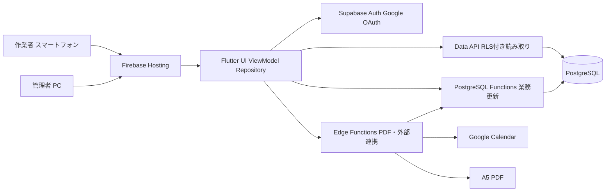
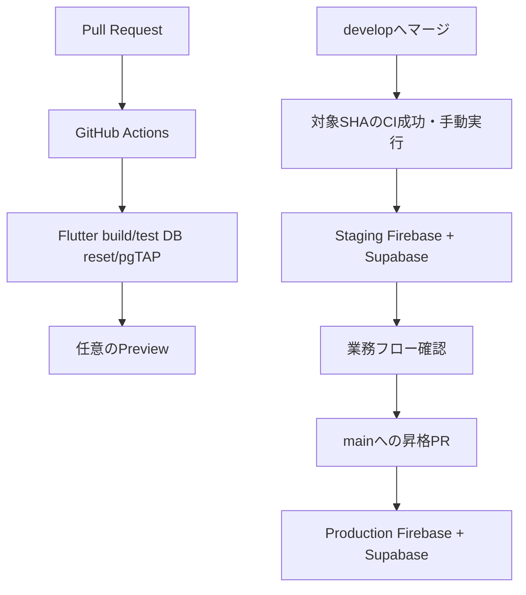

# ADR-0001: システム構成と担当境界

- 状態: 承認待ち（Issue #2の設計レビュー後に承認）
- 作成日: 2026-09-08
- 決定者: フロント設計者、バックエンド設計者、DB・CI設計者、要件責任者
- 対象Issue: [#2 FND-01](https://github.com/Re-Ochuns/Kiwi_peoducts/issues/2)
- 関連要件: [production-spec](../../production-spec/README.md)

## 1. 背景

本システムは、おおくま農園の収穫・仕入れから選果、冷蔵在庫、追熟、出荷までを管理する。作業者は主にスマートフォン、管理者は主にPCを利用し、同じ在庫を最大10人程度が同時に操作する。

重量、予約、出荷、表示ID、履歴にはサーバー側の整合性保証が必要である。同時に、スマートフォンでの入力速度、PCでの一覧性、段階リリース、3領域での並行開発を成立させる必要がある。

## 2. 決定

### 2.1 採用構成

初期本番はFlutter WebをFirebase Hostingから静的配信し、Supabaseを認証、Data API、PostgreSQL、サーバー処理の基盤として利用する。

| 層 | 採用技術 | 主な責務 |
|---|---|---|
| クライアント | Flutter Web / Dart | スマホ作業画面、PC管理画面、入力補助、画面状態、PDF表示・印刷操作 |
| 静的配信 | Firebase Hosting | Flutter Web成果物、HTTPS、環境別URL、SPAルーティング |
| 認証 | Supabase Auth + Google OAuth | ログイン、セッション、許可利用者の識別 |
| 読み取り | Supabase Data API | RLSで保護された一覧・詳細取得 |
| 業務更新 | PostgreSQL Function | トランザクション、排他、冪等性、採番、履歴 |
| データ | Supabase PostgreSQL | 正本データ、制約、RLS、索引、監査履歴 |
| サーバー処理 | Supabase Edge Functions / TypeScript (Deno) | PDF生成、Google Calendar、外部API、再試行 |
| CI/CD | GitHub Actions | Flutter検査・ビルド、DBテスト、環境別デプロイ |

初期対象はブラウザ版とする。iOS・Androidのネイティブ配布は、ブラウザで満たせない端末機能または運用要件が確認された場合に別ADRで判断する。

Firebase Hostingは、実験的なframework-aware連携へ依存せず、flutter build webで生成した静的成果物を標準Hosting設定で配信する。Preview Channelの採否はCI/CD Issueで決定する。

### 2.2 Flutter以外の言語

- 画面とクライアント状態はDartで実装する。
- DB制約、RLS、原子的な状態遷移はSQLまたはPL/pgSQLで実装する。
- PDF生成、Google Calendar同期、外部API連携はTypeScript/Denoで実装する。
- 入力補助はDartでも行うが、業務上の最終判定はサーバー側を正本とする。
- 同じ業務ルールをDart、SQL、TypeScriptへ重複実装しない。
- 新しい言語やランタイムの追加は、既存構成で満たせない要件と運用負担を記載したADRを必須とする。

Flutterだけに統一すると、DBトランザクション、RLS、秘密情報を要する外部連携をクライアントへ持ち込むことになる。このため、用途を限定してSQLとTypeScriptを併用する。

### 2.3 データアクセス原則

1. ViewとViewModelはSupabase SDKを直接呼ばず、Repositoryインターフェースを利用する。
2. 一覧・詳細などの読み取りは、RLSで保護されたViewまたはData APIを利用できる。
3. 登録、確定、取消、数量変更、採番、履歴保存などの更新は、原則としてPostgreSQL FunctionまたはEdge Functionを一回呼び出す。
4. 一つの業務操作をFlutterから複数テーブル更新へ分割しない。
5. PostgreSQL Functionはトランザクション内で権限、状態、数量、競合、冪等性を検証する。
6. Edge Functionから更新する場合も、業務更新はPostgreSQL Functionへ集約する。
7. 管理者の訂正もDB直接編集ではなく、理由と変更前後を残すアプリ機能として提供する。

### 2.4 論理構成



### 2.5 主要データフロー

読み取り:

```text
画面 → ViewModel → Repository → Data API → RLS → View/Table → 画面状態
```

検索条件、ページサイズ、並び順をAPIへ渡し、クライアントで全件を保持しない。

業務更新:

```text
確認操作
→ ViewModelが二重送信を抑止
→ Repositoryが冪等性キー付きRPCを一回呼ぶ
→ Functionが権限・状態・数量・競合を検証
→ 更新・履歴・表示ID採番を同一トランザクションで確定
→ 結果または分類済み業務エラー
→ 画面が最新状態を再取得
```

PDF・外部連携:

```text
Flutter → Edge Function → 認証・権限確認
                        → PostgreSQL Function / DB読み取り
                        → PDF生成またはGoogle API
                        → 実行状態・再試行・履歴を保存
```

外部サービスの失敗で正本データを失わない。Google Calendarはアプリを正本とする一方向同期とし、PDF印刷はブラウザ印刷を利用する。

### 2.6 デプロイ構成



- Local、Staging、ProductionでFirebase、Supabase、OAuth設定、秘密情報を分離する。
- LocalとStagingはダミーデータだけを使用し、実在する顧客・配送先情報を投入しない。
- developへのマージと対象SHAのCI成功後、Staging Deploymentを手動実行して反映する。自動配備は行わない（Issue #99）。[運用手順](../development/staging.md)に従って受入条件を確認する。
- Productionはmainへの承認済み昇格を起点とし、手動承認を必須とする。
- DB migrationをアプリより先に後方互換な形で適用し、破壊的変更は複数段階で移行する。
- マージ済みmigrationは編集せず、修正migrationを追加する。
- アプリは直前成果物の再配信で戻す。DBは安易な逆migrationではなく、修正migrationまたは承認済み復旧手順を用いる。

### 2.7 秘密情報

| 情報 | Flutterへ含めてよいか | 保管場所 |
|---|---|---|
| Supabase URL、公開可能キー | 可。RLS前提 | 環境別ビルド設定 |
| Service Roleキー | 不可 | Supabase / GitHubの保護Secret |
| Google OAuth公開設定 | 公開可能部分のみ | 環境設定 |
| Google API秘密鍵・更新トークン | 不可 | Edge Function Secret |
| 個人情報・本番データ | 不可 | Production DBのみ |

SecretをGit、Flutterアセット、ログ、PR成果物へ含めない。Production SecretをPR、Preview、Stagingへ渡さない。ログにはトークン、住所、顧客情報、自由入力の原文を不用意に記録しない。

## 3. 担当境界

| 対象 | 実装責任 | 必須レビュー |
|---|---|---|
| Flutter View / ViewModel / UI状態 | フロント | フロント。入力項目・状態変更は全担当と要件責任者 |
| Repositoryインターフェース / DTO | フロント | バックエンド。RPC変更は3担当 |
| RPC契約 / 業務エラー | バックエンド | フロント、DB・CI |
| PostgreSQL Function | バックエンド | DB・CI。状態・重量ルールは要件責任者 |
| Edge Function | バックエンド | DB・CI。外部送信データは要件責任者 |
| Table / Constraint / Index | DB・CI | バックエンド |
| RLS / Auth / Secret | DB・CI | バックエンド。権限変更は全担当と要件責任者 |
| Migration / Seed / pgTAP | DB・CI | バックエンド |
| GitHub Actions / Hosting / Deploy | DB・CI | 影響領域担当。Production承認者を実行者と分離 |
| production-spec | 要件責任者 | 影響する全担当 |

実装責任者は単独で境界を越える変更を確定しない。必須レビュー担当が不在の場合は、Issueへ代理レビュー者と理由を記録する。

```text
apps/kiwi_inventory/     フロント
contracts/               3担当共同
supabase/functions/      バックエンド
supabase/migrations/     DB・CI
supabase/tests/          バックエンド、DB・CI共同
.github/workflows/       DB・CI
docs/adr/                3担当共同
production-spec/         要件責任者が正本管理
```

## 4. 代替案

### Flutter Web + Supabase + Firebase Hosting（採用）

スマホとPCを一つのFlutterコードベースで提供できる。Supabaseへ認証、PostgreSQL、RLS、Functionを集約でき、年間2万コンテナ、同時10人以下という暫定規模に対して運用しやすい。一方、SQLとTypeScriptの習熟、Flutter Webのブラウザ差異、印刷検証が必要となる。

### Flutterネイティブアプリ + Supabase

端末機能やオフライン、直接印刷には有利だが、初期要件はブラウザ印刷、安定ネットワーク、オフライン対象外である。ストア配布と端末別リリースの負担が先行するため採用しない。

### React / Next.js + Supabase

PC中心のWeb画面には適するが、Flutter採用前提を変更する決定的な要件はない。Flutter Webで性能、アクセシビリティ、印刷に許容できない問題が実機検証で判明した場合に再評価する。

### 独自APIサーバー + PostgreSQL

複雑な業務層や長時間処理の自由度は高いが、初期規模ではサーバー、認証、監視、デプロイの運用負担が増える。Supabaseで満たせない要件が出るまで採用しない。

### Flutterからテーブルを直接更新

単純なCRUDは短期間で実装できるが、整合性、履歴、採番、競合、冪等性がクライアントへ分散するため採用しない。

## 5. 影響

利点:

- 画面と契約・DBをRepository/RPC境界で並行開発できる。
- 業務ルールをサーバー側へ集約し、端末や再送による不整合を防げる。
- 配信対象をWebへ絞り、段階的に機能を増やせる。
- RLSと環境分離により、本番データのアクセス境界を明示できる。

コストと制約:

- Dartに加えてSQL/PLpgSQLとTypeScript/Denoを扱う。
- Flutter Webのブラウザ差異、文字拡大、PDF印刷は実機試験が必要である。
- Supabase固有のAuth、RLS、Function、migration運用へ依存する。
- 環境間で設定を手動コピーせず、CIと手順で同期する必要がある。

## 6. 未決事項と追跡先

詳細を推測で確定せず、既存Issueで決定する。

| 未決事項 | 追跡先 | このADRで固定する境界 |
|---|---|---|
| SDK、パッケージ、モノレポ詳細 | [#3 FND-02](https://github.com/Re-Ochuns/Kiwi_peoducts/issues/3) | Flutter Webとディレクトリ所有 |
| RPC要求・応答、エラー、冪等性 | [#4 FND-03](https://github.com/Re-Ochuns/Kiwi_peoducts/issues/4) | 更新はRPC/Functionへ集約 |
| 状態管理、ルーティング、レスポンシブ | [#5 FND-04](https://github.com/Re-Ochuns/Kiwi_peoducts/issues/5) | View/ViewModel/Repository分離 |
| Google認証、プロフィール、初期RLS | [#6 FND-05](https://github.com/Re-Ochuns/Kiwi_peoducts/issues/6) | 本番Google認証と環境分離 |
| A5 PDFの生成場所、対象端末・プリンター | [#8 FND-07](https://github.com/Re-Ochuns/Kiwi_peoducts/issues/8) | ブラウザ印刷と実機検証 |
| CI、Preview、デプロイ、ロールバック詳細 | [#9 FND-08](https://github.com/Re-Ochuns/Kiwi_peoducts/issues/9) | develop→Staging、main→Production |

業務上の未決事項O-01〜O-15は[未決事項リスト](../../production-spec/05_OPEN_QUESTIONS.md)を正本とし、対象段階の設計Issueから解決用Issueを分離する。

## 7. 技術的前提の確認元

- [Flutter: Build and release a web app](https://docs.flutter.dev/deployment/web)
- [Firebase Hosting](https://firebase.google.com/docs/hosting)
- [Supabase Flutter quickstart](https://supabase.com/docs/guides/getting-started/quickstarts/flutter)
- [Supabase: Securing your data](https://supabase.com/docs/guides/database/secure-data)
- [Supabase: Securing Edge Functions](https://supabase.com/docs/guides/functions/auth)

## 8. 要件適合確認

- スマホ360〜430pxとPC 900px以上を同じ正本データで提供できる。
- 作業画面と管理画面は表示モードであり、初期本番の細かな権限差とはしない。
- 重量、予約、出荷、採番、履歴をサーバー側で検証できる。
- A5 PDFとGoogle Calendarの失敗を正本データの確定から分離できる。
- LocalとStagingへ実在顧客情報を投入しない。
- 既存の段階1〜3の業務状態・データモデルを変更しない。

## 9. 承認チェック

- [ ] フロント設計者: Repository境界とFlutter Web制約
- [ ] バックエンド設計者: RPC、Function、Edge Function境界
- [ ] DB・CI設計者: RLS、migration、環境、デプロイ境界
- [ ] 要件責任者: 業務要件、段階リリース、未決事項との整合

全チェック完了後、状態を「承認済み」へ変更する。構成または責務境界を変更する場合は、このADRを上書きせず、新しいADRで置換する。
