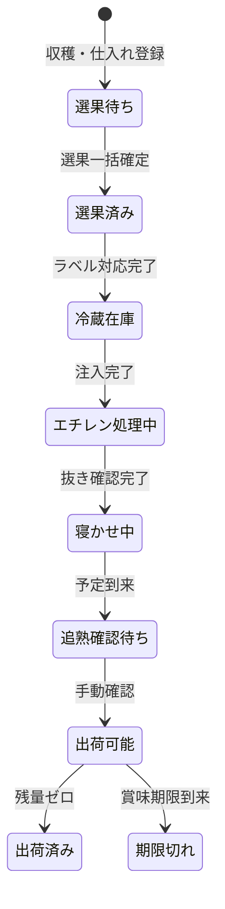
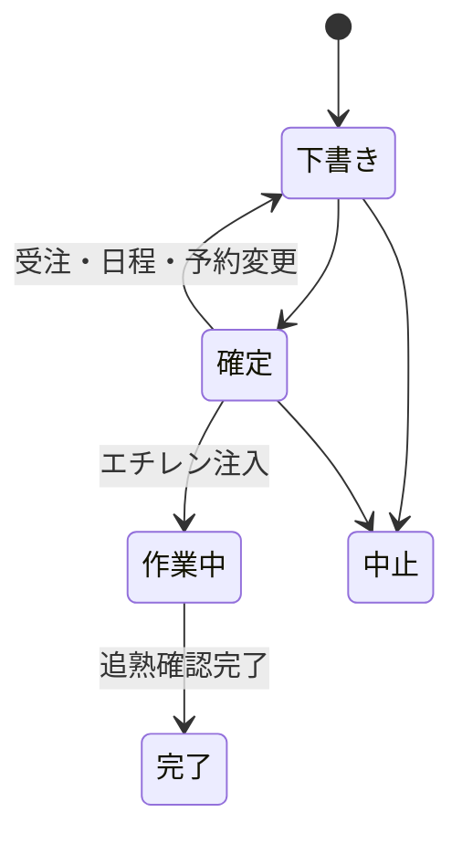
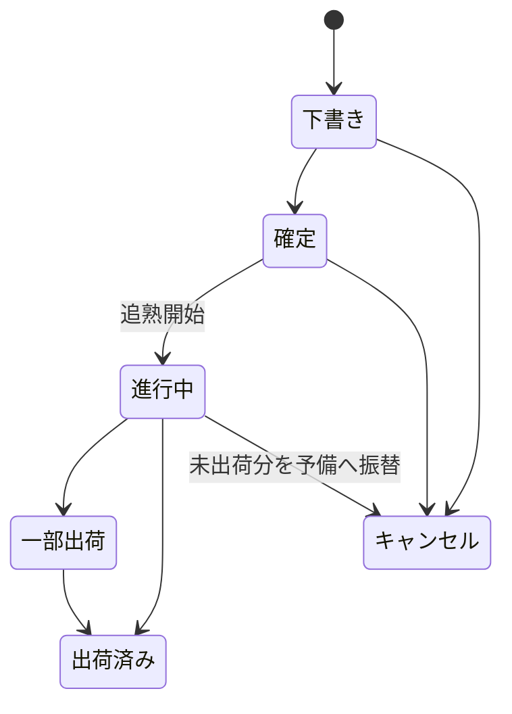

# 03. 状態遷移・データモデル

## 1. 状態を分離する原則

一本の状態列へすべてを格納しない。追熟計画、在庫予約、現物工程、作業タスクは同時に異なる状態を持つ。

## 2. 受入・選果・現物工程



選果待ち、選果済み、冷蔵在庫は工程状態である。実際に冷蔵されていることとは別に扱う。

## 3. 追熟計画

- 作業者画面または管理者画面から作成できる。同じ追熟計画データを使用し、作成元の画面によって状態や権限制御を変えない。
- 作成時に元冷蔵コンテナ、予約重量、追熟内訳、場所、エチレン注入予定日時、担当者を保持する。
- 1つの追熟ロットは複数の追熟内訳を持つことができる。内訳には受注または予備と、その割当重量を記録する。
- 同じ追熟コンテナへ受注と予備、または複数受注を同時に割り当てられる。
- 用途区分は内訳から自動判定し、受注のみを「受注」、予備のみを「予備」、両方を含む場合を「複合」とする。
- 計画作成時に追熟マスターの処理条件をコピーし、追熟完了予定日時を計算する。



## 4. 在庫予約

```text
未予約 → 一部予約 → 予約済み → 使用済み
                    └→ 解除（作業開始前のみ）
```

- 予約はコンテナ内重量を対象とする。
- 同一重量を複数受注・計画へ予約できない。
- 受注所有の予約は追熟計画の作成前から保持する。計画への引き継ぎは二重計上しない。
- 計画取消時は有効な受注の予約を未計画へ戻し、受注取消時にその受注の予約を解放する。
- 新旧データの扱いと集計式は[受注時予約への変更](11_ORDER_INVENTORY_RESERVATION.md)を参照する。
- `予約量 <= 現在量`を保証する。
- 作業開始後のキャンセル量は解除せず、予備割当へ変更する。

## 5. 作業タスク

| 種別 | 発生条件 | 完了操作 |
|---|---|---|
| 選果 | 選果待ち登録 | 選果一括確定 |
| ラベル対応 | 選果または追熟コンテナ生成 | 印刷済み／手書き対応 |
| エチレン注入 | 追熟計画確定 | 注入完了 |
| エチレン抜き確認 | 処理終了予定到来 | 抜き確認完了 |
| 追熟確認 | 寝かせ終了予定到来 | 出荷可能へ変更 |
| 出荷 | 出荷予定 | 出荷確定 |

タスクには予定日時、期限状態、完了日時、作業担当者、備考、対象画面リンクを持つ。

## 6. 受注状態



## 7. 主要エンティティ

| エンティティ | 主な情報 |
|---|---|
| 受入ロット | 区分、日付、産地、樹体または仕入先、品種、総重量、コンテナ数、選果期限 |
| 選果実績 | 元ロット、選果日、担当者、ロス、出力コンテナ |
| コンテナ | 内部ID、表示ID、品種、等級、現在量、予約量、状態、場所、親ロット |
| 顧客 | 名前、通称、郵便番号、住所、有効状態 |
| 配送先 | 顧客、名称、郵便番号、住所、有効状態 |
| 受注 | 受注番号、顧客、配送先スナップショット、注文日、出荷予定日、品種、等級、注文量、状態 |
| 追熟ロット | 表示ID、用途区分（受注／予備／複合）、マスターコピー、予定・実績日時、場所、状態、担当者、備考 |
| 追熟割当 | 追熟ロット、割当種別（受注／予備）、受注番号、割当重量。1追熟ロットに複数作成可能 |
| 在庫予約 | 所有受注（予備の場合はなし）、追熟計画（未計画の場合はなし）、元コンテナ、予約重量、状態、引き継ぎ履歴 |
| 作業タスク | 種別、対象、予定日時、実績日時、状態、担当者、備考 |
| 出荷 | 受注、出荷日、取引先、出荷明細、状態 |
| 出荷明細 | 出荷、追熟コンテナ、出荷重量 |
| ラベル印刷 | 対象コンテナ、状態、必要枚数、印刷枚数、再印刷回数 |
| 変更履歴 | 対象種別、対象ID、変更前、変更後、変更日時、理由 |
| マスター | 品種、等級、場所、作業者、仕入先、追熟条件、選果期限 |

## 8. 重量整合性

```text
選果ロス = 受入ロット総重量 − 選果後コンテナ重量合計
使用可能量 = コンテナ現在量 − 予約量
出荷後残量 = 出荷前現在量 − 出荷重量
追熟重量 = 追熟割当重量の合計
```

- 重量はkg、0.01kg単位とする。
- 負数を許可しない。
- 選果後重量が元重量を超える確定を禁止する。
- 予約量が現在量を超える確定を禁止する。
- 出荷重量が使用可能な残量を超える確定を禁止する。
- 出荷後も同じコンテナIDで残量を保持する。取消は元イベントを参照する逆在庫イベントで復元する。
- 出荷後の用途は、計画の受注割当から取消を除く出荷済量を引いた未出荷割当で判定する。未出荷割当がない残量は予備、未出荷割当と予備を含む残量は複合とする。
- 計画の割当・用途区分は履歴として保持し、残在庫の表示には出荷読取RPCの `remaining_use_type` を使う。取消後は未出荷割当と残量から用途を再計算する。
- 追熟内訳の各重量は0より大きい値とし、内訳合計が追熟重量と一致しない場合は計画確定を禁止する。

## 9. ID

- 全データは外部へ表示しない一意な内部IDを持つ。
- ラベルと画面では年度別表示IDを使用する。
- 表示IDは発行後に変更・再採番しない。

```text
受入-2027-001
選果-2027-001
選果-2027-001-1
追熟-2027-001
追熟-2027-001-1
出荷-2027-001
```

末尾の短い枝番はロットから生成されたコンテナを一意に識別する。

## 10. マスターの履歴

追熟マスターは、適用年度、収穫月、品種、エチレン処理温度・時間、寝かせ温度・期間、追熟後賞味期限日数、追熟後出荷可能日数を持つ。組み合わせは一意とする。前年度産は収穫年度のマスターを使用する。計画作成時に値をコピーし、マスター更新で既存計画を変えない。

### S3-04 収穫年度と期限の実装

前年度産は実際の収穫年度・月のマスターを使う。計画へ収穫年度・月を明示し、受入日や注入日から推測しない。
注入基準の抜き予定・寝かせ終了に、追熟後出荷可能日数・賞味期限日数を加えて期限を求める。1日は24時間とする。
計画予定と実績基準の計算予定は別項目で保持する。期限超過フラグはタスクの完了状態と独立する。
自動更新履歴の実行者はnull（システム）とし、人物の操作と区別する。
詳細は [追熟予定・期限の契約](../contracts/rpc/ripening_deadlines.md) を参照。
